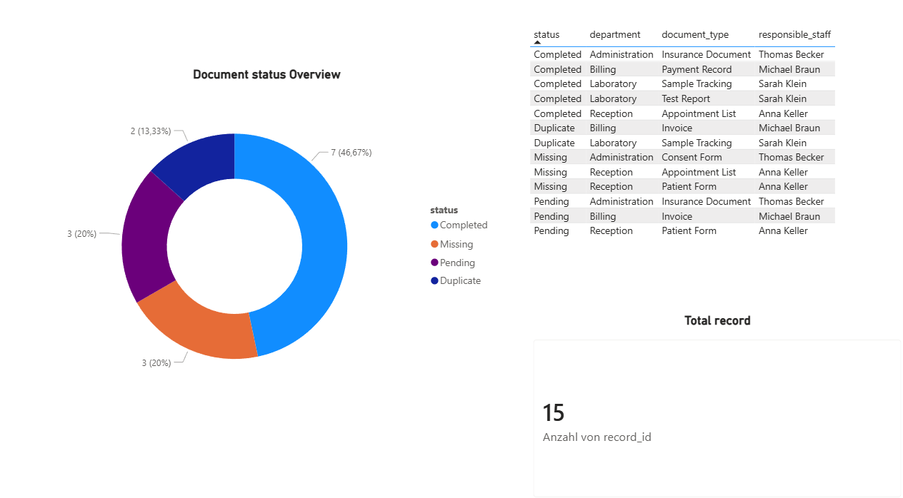

# Clinic Document Organization

A practical workflow and document organization project focused on improving operational clarity, administrative reporting and data accessibility within a small clinic environment.

---

## Project Overview

This project demonstrates how scattered Excel files, administrative records and operational documents can be transformed into a clearer, more structured and easier-to-manage workflow system.

The scenario is based on a small clinic where appointment lists, invoices, patient forms and internal administrative documents were stored inconsistently across multiple files and formats. The lack of structure created difficulties in document tracking, reporting and daily operational workflows.

The goal of the project was to improve organization, reduce confusion and create a more transparent workflow structure for administrative processes.

---

## Project Goals

* Organize scattered operational documents and records
* Improve accessibility and workflow clarity
* Clean inconsistent and duplicate data entries
* Detect missing administrative records
* Create a simple reporting structure
* Improve operational transparency

---

## Tools & Technologies

* Python
* Pandas
* Microsoft Excel
* Power BI
* CSV/XLSX Data Handling
* Data Quality Checks
* Process Documentation

---

## Main Tasks

* Cleaning inconsistent records
* Detecting duplicate and missing entries
* Structuring operational data
* Standardizing document organization
* Creating workflow reporting dashboards
* Improving administrative visibility

---

## Dashboard Overview

The dashboard was designed to provide a quick operational overview of document status and workflow transparency.

Main dashboard components:

* Document status overview
* Pending and missing records
* Department activity overview
* Responsible staff visibility
* Administrative workflow tracking

---

## Validation & Data Quality

Several validation checks were implemented during the project:

* Missing status detection
* Duplicate record identification
* Pending workflow tracking
* Department-based overview analysis
* Administrative process monitoring

---

## Workflow Summary

The project identified several operational inefficiencies caused by fragmented document handling and inconsistent data management.

Implemented improvements included:

* Structured file organization
* Standardized formatting
* Improved reporting visibility
* Simplified administrative tracking
* Better workflow transparency

The updated structure improved document accessibility and reduced manual searching effort in daily operations.

---

## Project Structure

```text
clinic-document-organization/
│
├── data/
│   ├── raw/
│   └── cleaned/
│
├── scripts/
├── dashboard/
├── screenshots/
├── reports/
└── docs/
```

---

## Dashboard Preview



---

## Project Status

Project in development.

---

## Author

Sarah Tabatabaee

Workflow & Data Management Portfolio
